1-Apresentação do projeto

Proposta de trabalho:

No âmbito da disciplina de Tecnologias Internet, decidimos desenvolver o trabalho
de grupo, focando-nos especificamente no universo do Cinema, abrangendo tanto
filmes como séries. Escolhemos este tema por ser algo bastante interessante para o
grupo e de relevância ao longo dos anos em que existe. Consideramos também que
este tema oferece diversas possibilidades criativas, permitindo explorar conteúdos
históricos, tecnológicos e visuais de forma mais ‘divertida’.
Relativamente à estrutura do website, estamos a pensar organizar o conteúdo em
várias páginas distintas, de forma a garantir uma navegação simples e intuitiva para
o utilizador. As páginas planeadas até ao momento são as seguintes:

• Menu / Página Principal
Esta será a página inicial do website, que atua como ponto de entrada para todas as
restantes páginas. Aqui pretendemos apresentar o tema principal do projeto, incluir
imagens, vídeos, etc..., relacionados com cinema e disponibilizar um menu de
navegação claro e acessível.

• História do Cinema
Nesta página vamos abordar a origem do cinema, desde os primeiros filmes e
invenções cinematográficas até ao desenvolvimento da indústria cinematográfica
dos dias de hoje. Pretendemos destacar momentos importantes e figuras marcantes
da história do cinema.

• Cinema ao Longo da História
Esta secção terá como objetivo mostrar a evolução do cinema ao longo das
diferentes décadas, deixando evidentes as mudanças nos géneros cinematográficos,
estratégias de produção, estilos de realização, etc..., em diferentes épocas.

• Evolução do Equipamento de Filmagem e Edição
Aqui iremos explorar a evolução tecnológica do cinema, desde as primeiras câmaras
até aos equipamentos digitais atuais, mencionando também programas e técnicas de
edição de vídeo que revolucionaram a produção cinematográfica.

• Filmes Mais Influentes
Nesta página pretendemos apresentar alguns dos filmes mais importantes e
influentes da história do cinema, explicando o impacto que tiveram na indústria, na
sociedade e na cultura pop.

Nota:
Estas cinco páginas estarão garantidamente no projeto final. No entanto, poderão
surgir páginas adicionais caso consideremos necessário.

Relativamente ao design do website, pretendemos criar uma interface relacionada
com o tema. A inspiração principal será a Netflix, utilizando uma estética visual
semelhante, especialmente na página principal. Estamos a pensar utilizar
predominantemente preto, combinados com detalhes em vermelho, de forma a
simular uma plataforma de streaming.

Apesar de mantermos uma identidade visual consistente ao longo do website,
pretendemos que cada página tenha pequenas diferenças de formato e organização,
adaptando o formato ao tipo de conteúdo apresentado.
Para a realização deste projeto iremos utilizar as linguagens e tecnologias abordadas
nas aulas, nomeadamente:

• HTML5
• CSS3
• JavaScript
• XML e XSD
----------------------------------------------------------------------------------------------

Concretizamos maioria das coisas que propusemos, porém como as páginas "Cinema ao Longo da História" e "História do Cinema" tinham um tema bastante redundante decidimos fazer só uma "História do Cinema"

Menu Inicial:

Na página Menu Inicial.html, foi criado um layout inspirado na interface da Netflix, com fundo escuro, destaque em vermelho e apresentação visual através de cartões com imagens. Esta página funciona como o ponto de entrada do website e como um hub de navegação para as restantes páginas do projeto.

No topo da página existe um header com o título principal “Cinema” e um menu de navegação com ligações para páginas como Top10.html e Formulario.html. A parte principal da página apresenta uma secção com várias imagens organizadas numa lista horizontal. Cada imagem funciona como uma âncora/hiperligação para outra página do site, permitindo ao utilizador escolher visualmente o conteúdo que quer consultar.

Também foi utilizado JavaScript para criar um sistema de navegação por carrossel. As setas laterais permitem avançar e recuar entre os cartões de imagens, usando eventos de clique e o método scrollIntoView. Isto torna a página mais interativa e melhora a experiência de navegação.

História do Cinema:

A página HistoriaCinema.html apresenta uma explicação sobre a evolução do cinema ao longo do tempo. O conteúdo começa com o nascimento do cinema, referindo os irmãos Lumière e as primeiras exibições públicas, e continua com várias fases importantes, como o cinema mudo, o aparecimento do som, a chegada da cor, a expansão de Hollywood e o cinema atual.

A informação está organizada em blocos de conteúdo com títulos e descrições, usando elementos como dl, dt e dd. Também existem listas com exemplos e curiosidades relacionadas com a história do cinema. Ao longo da página são usadas imagens de figuras importantes, como Charlie Chaplin, Buster Keaton, Marilyn Monroe e Audrey Hepburn, ajudando a tornar o conteúdo mais visual e ligado ao tema multimédia.

No final, existe um footer com ligações internas para outras páginas do projeto, facilitando a navegação sem ser necessário voltar manualmente ao menu inicial.

Filmes Influentes:

A página FilmesInfluentes.html apresenta alguns filmes considerados importantes para a história do cinema. Entre os exemplos incluídos estão Citizen Kane, O Padrinho, Star Wars, Matrix e Avatar. Para cada filme, são apresentados diferentes tipos de impacto: impacto na indústria cinematográfica, impacto na sociedade e impacto na cultura popular.

A página utiliza imagens dos filmes para tornar a apresentação mais visual. Também usa listas não ordenadas para organizar os pontos principais de cada filme, o que facilita a leitura e a comparação entre os exemplos. O elemento strong é utilizado para destacar os títulos das categorias, como “Impacto na Indústria”, “Impacto na Sociedade” e “Impacto na Cultura Pop”.
Esta página demonstra também o uso de ligações internas no rodapé, permitindo ao utilizador regressar ao menu inicial ou visitar outras páginas do site, como a história do cinema e a evolução do equipamento.

Evolução do Equipamento:

A página EvolucaoEquip.html explica a evolução dos equipamentos de filmagem ao longo da história do cinema. Começa por falar dos primeiros equipamentos, como o cinematógrafo dos irmãos Lumière, e avança para temas como o cinema mudo, a chegada do som, o cinema colorido e tecnologias mais recentes.

Esta página foi também usada para demonstrar vários requisitos técnicos do trabalho. Inclui elementos semânticos como main, aside, article, figure, figcaption e address. As imagens aparecem dentro de figure, acompanhadas por legendas através de figcaption, tornando a marcação mais correta e semântica.

A página contém ainda uma lista ordenada com uma lista aninhada, representando as principais etapas da evolução do cinema. Também inclui uma tabela comparativa com thead, tbody, tfoot, rowspan e colspan, onde são comparados períodos, equipamentos e tecnologias.
No CSS desta página foram aplicados vários requisitos: imagem de fundo, seletores de atributo, float, position, media queries, animação com @keyframes, formatação de tabela e substituição de texto por imagem através da classe .logoCinema.

Top 10 Personagens:

A página Top10.html apresenta um conjunto de personagens marcantes do cinema. Ao contrário das páginas mais estáticas, esta página utiliza JavaScript para carregar informação a partir do ficheiro characters.xml.

O código JavaScript usa fetch para ler o XML e DOMParser para transformar o conteúdo XML em dados que podem ser usados no HTML. Depois, a página percorre cada elemento personagem e cria cartões com informações como nome, filme, ator, franquia e ano. Assim, o conteúdo do XML é integrado dinamicamente na página.

Esta página também inclui uma hiperligação para descarregar o ficheiro XML, cumprindo o requisito de disponibilizar o documento XML ao utilizador. O ficheiro characters.xsd funciona como schema, definindo a estrutura esperada para os dados das personagens.

Formulário:

A página Formulario.html contém um formulário interativo sobre o filme favorito do utilizador. O objetivo é recolher informações como o nome do utilizador, o filme favorito, o ano de lançamento, o género, a personagem favorita, a classificação atribuída ao filme e o motivo da escolha.

O formulário utiliza vários tipos de campos HTML, como input type="text", input type="number", select, input type="range" e textarea. Foram também aplicadas validações nativas através do atributo required, garantindo que o utilizador preenche os campos obrigatórios antes de submeter.

A página está ligada ao ficheiro script.js, que acrescenta interatividade. O JavaScript atualiza o valor da classificação quando o utilizador move o controlo deslizante e, após a submissão do formulário, impede o envio tradicional da página e apresenta um resumo com as respostas introduzidas. Assim, esta página demonstra a utilização de JavaScript para alterar conteúdo HTML e mostrar elementos dinamicamente.

Apesar de mantermos uma identidade visual consistente ao longo do website,
pretendemos que cada página tenha pequenas diferenças de formato e organização,
adaptando o formato ao tipo de conteúdo apresentado, sendo a maior diferença a da página "Evolução do Equipamento".

Para isso utilizamos as linguagens abordadas nas aulas, nomeadamente:

• HTML5
• CSS3
• JavaScript
• XML e XSD

Todas foram utilizadas de diferentes maneirass que já foram mencionadas acima

----------------------------------------------------------------------------------------------

2- Interface com o utilizador

Nesta parte do relatório apresentaremos uma pequena sketch inicial de cada página e o seu produto final.

Menu Inicial:

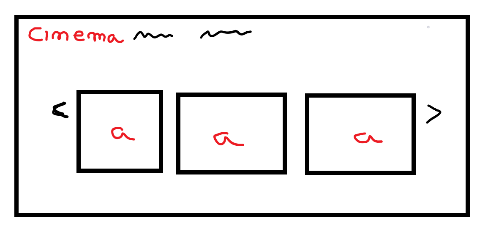

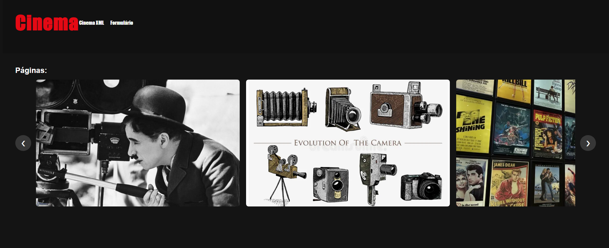

Páginas com informação:

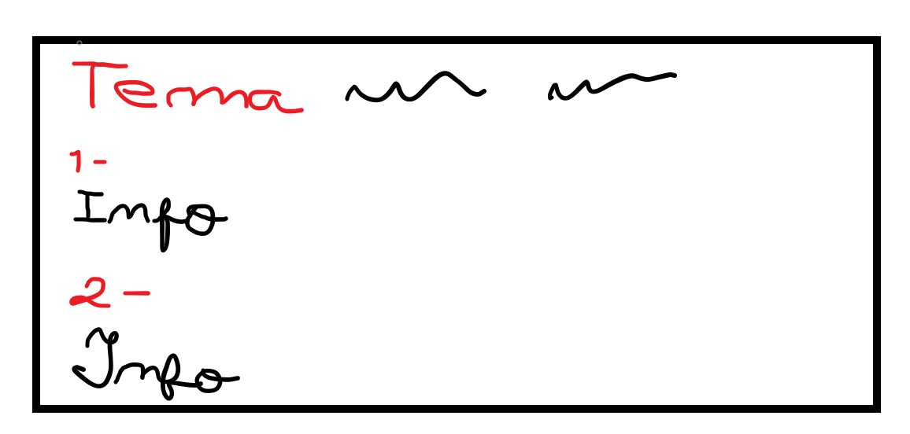

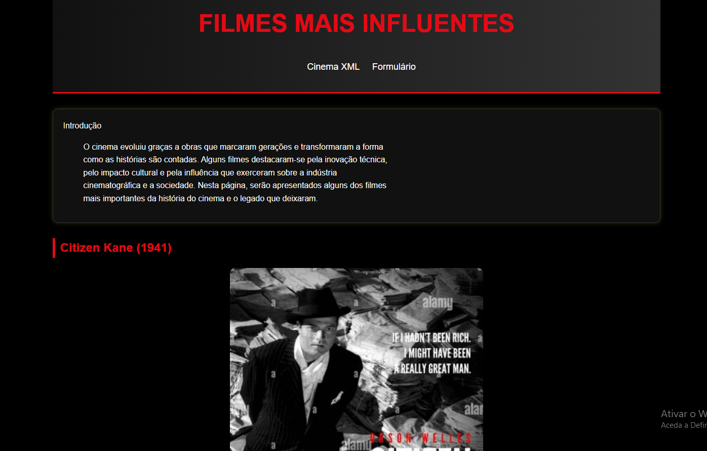

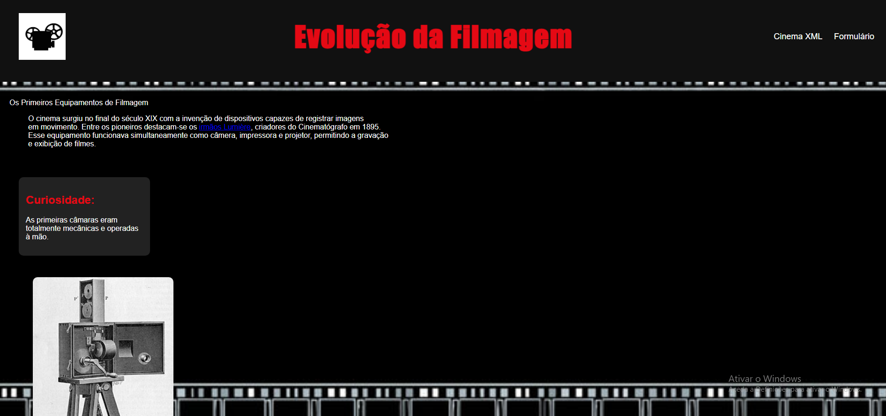

Formulário: 

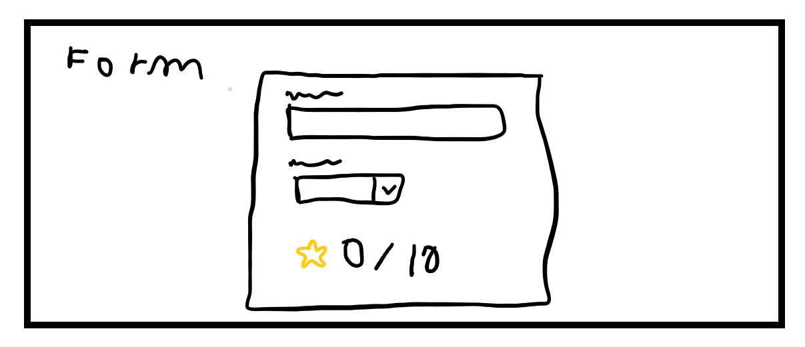

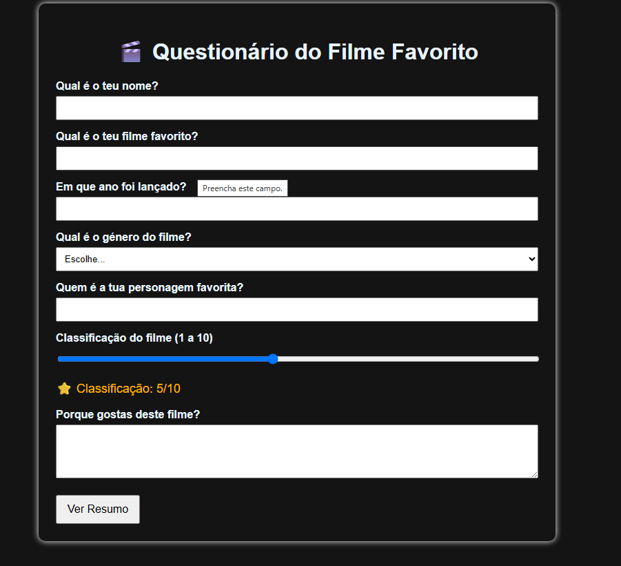

A página Top10 não teve Sketch mas este foi o resultado final:

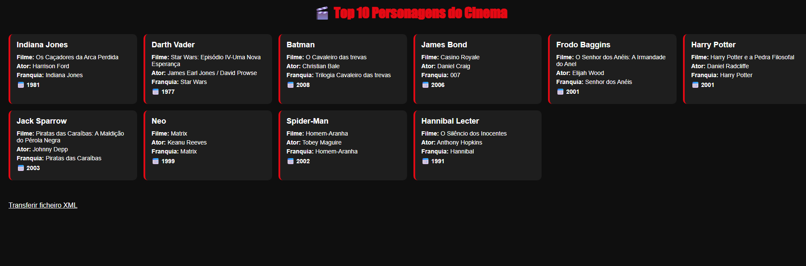

-----------------------------------------------------------------------------------------------

3-Produto

Descrição do Produto:

O produto desenvolvido consiste num website estático sobre a temática “Multimédia”, tendo como tema principal o cinema. O site apresenta várias páginas informativas relacionadas com a história do cinema, filmes influentes, evolução dos equipamentos de filmagem, personagens marcantes e um formulário interativo sobre o filme favorito do utilizador.
O website foi desenvolvido com HTML5, CSS3 e JavaScript. Inclui também um documento XML com informação sobre personagens do cinema e o respetivo schema XSD para validação da estrutura dos dados. Uma das páginas integra dinamicamente conteúdo do XML através de JavaScript, transformando os dados em elementos HTML apresentados ao utilizador.

Ligação para o site do grupo em Netlify:
O website foi publicado através da plataforma Netlify, permitindo o acesso online ao projeto.

Ligação do site:
[Link Netlify](https://inf25tig07.netlify.app)

Nota:
Para isto o MenuInicial.html foi alterado para index.html!

Instruções de Instalação e Configuração:

Para instalação local, basta colocar todos os ficheiros do projeto na mesma pasta, mantendo a estrutura original dos ficheiros HTML, CSS, JavaScript, XML, XSD e imagens. Depois, deve abrir-se o ficheiro MenuInicial.html num navegador, pois esta página funciona como página inicial do site.
No entanto, para garantir o correto funcionamento da página Top10.html, que utiliza JavaScript para carregar o ficheiro characters.xml, é recomendado abrir o projeto através de um servidor local. Isto evita possíveis bloqueios do navegador ao carregar ficheiros XML diretamente através de file://.
Para publicação no Netlify, pode ser usado o método de deploy manual. Neste caso, basta aceder ao Netlify, escolher a opção de adicionar um novo site e arrastar a pasta do projeto ou o ficheiro .zip com todos os ficheiros. Como se trata de um website estático, não é necessário configurar comandos de build. A pasta de publicação corresponde à raiz do projeto, onde se encontram os ficheiros .html.
Caso seja usada instalação automática através de repositório Git, a configuração também é simples: o repositório é ligado ao Netlify, o comando de build fica vazio e a pasta de publicação deve ser a pasta principal do projeto.

Regras de Utilização:
O website não exige autenticação nem criação de conta. Qualquer utilizador pode aceder às páginas, navegar pelos conteúdos e preencher o formulário.
As principais limitações do produto são o facto de ser um site estático, sem base de dados e sem sistema de armazenamento permanente das respostas do formulário. Assim, os dados introduzidos pelo utilizador são apenas apresentados no momento, através de JavaScript, mas não ficam guardados depois de fechar ou atualizar a página.
Ajuda à Navegação

A navegação foi organizada através de menus presentes no cabeçalho das páginas e através de ligações internas no rodapé de algumas páginas. A página MenuInicial.html funciona como hub principal, apresentando imagens em formato de cartões, semelhantes a um layout inspirado na Netflix. Essas imagens servem como ligações visuais para outras páginas do site.
Foram utilizadas regras visuais para facilitar a navegação, como alteração de cor nos links ao passar o rato, destaque dos títulos principais em vermelho e organização dos conteúdos por secções. Também foram usadas imagens com atributo alt, o que ajuda na acessibilidade e na identificação do conteúdo caso a imagem não carregue. Não foram usados tooltips específicos.
Validações de Formulários

A página Formulario.html contém um formulário sobre o filme favorito do utilizador. A validação dos dados é feita principalmente através de validação nativa do HTML5.
Foram usados campos obrigatórios com o atributo required, impedindo a submissão do formulário caso informações essenciais não sejam preenchidas. Também foram usados diferentes tipos de campos, como text, number, select, range e textarea, adequando cada campo ao tipo de informação pretendida.
Além disso, o ficheiro script.js melhora a interação com o formulário. O JavaScript atualiza dinamicamente o valor da classificação atribuída pelo utilizador e, após a submissão, impede o recarregamento da página e apresenta um resumo com os dados introduzidos.
Validação do HTML e CSS

A validação dos ficheiros HTML5 e CSS3 deve ser realizada através dos validadores oficiais da W3C.
Para validar o HTML, foi utilizado o W3C Markup Validation Service, onde cada ficheiro .html foi submetido individualmente. Para validar o CSS, foi utilizado o W3C CSS Validation Service, submetendo cada ficheiro .css do projeto.

Após a validação, devem ser guardadas capturas de ecrã dos resultados para servirem como comprovativos no relatório. Caso sejam encontrados erros ou avisos, estes devem ser corrigidos nos ficheiros correspondentes e a validação deve ser repetida até obter resultados corretos.

Comprovativos dos testes:

Todos os CSS e HTML foram validados nos respetivos validadores da W3C

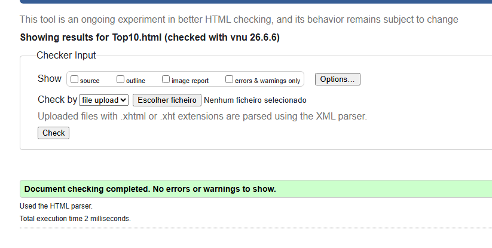
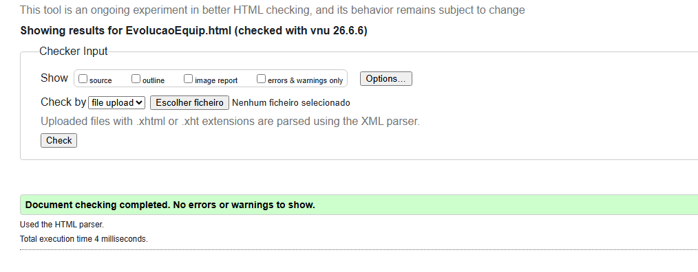
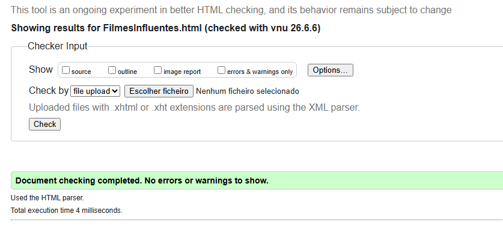
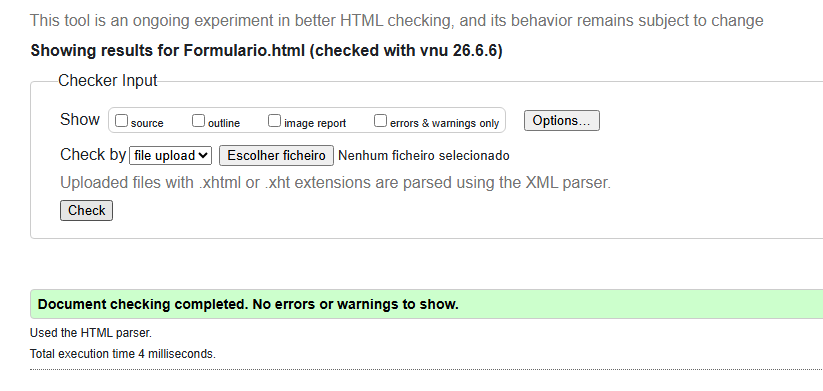
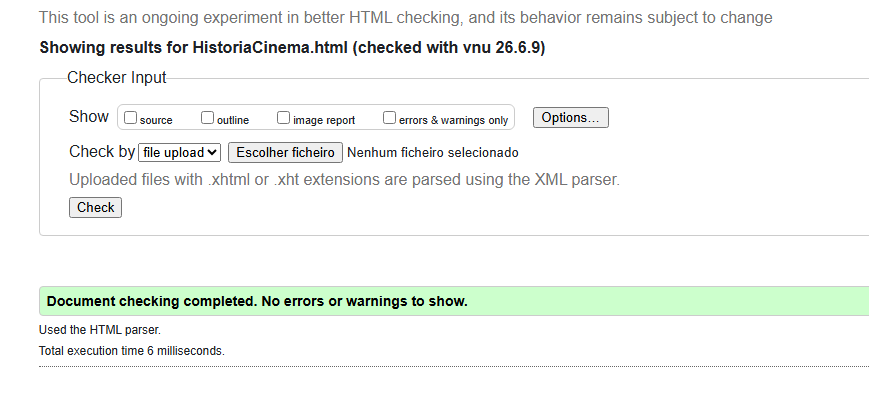
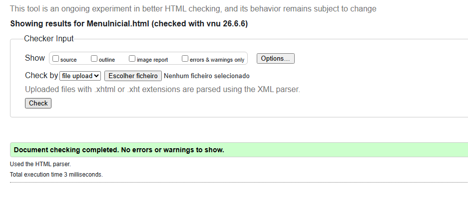

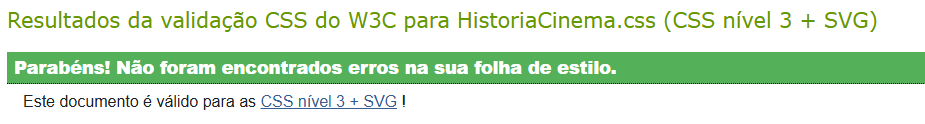
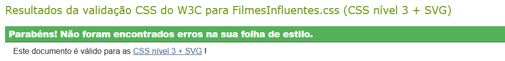
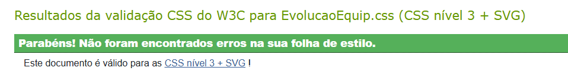
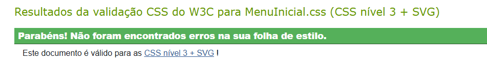
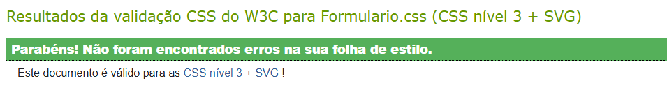

Detalhes de Implementação:

O projeto cumpre os principais objetivos mínimos definidos no enunciado. Foram criadas várias páginas HTML estáticas relacionadas com o tema multimédia/cinema, todas com estilos definidos em ficheiros CSS externos.
O projeto inclui um documento XML, characters.xml, com dados sobre personagens do cinema, e um schema XSD, characters.xsd, responsável por definir a estrutura esperada desse documento. A página Top10.html utiliza JavaScript para carregar o XML e apresentar dinamicamente os dados no HTML.

Foram utilizados vários elementos semânticos de HTML5, como header, nav, main, section, article, aside, figure, figcaption, address e footer. O projeto inclui também listas ordenadas, listas não ordenadas, listas de definição, uma lista aninhada, imagens, hiperligações internas e externas, formulário e uma tabela com thead, tbody, tfoot, rowspan e colspan.
Nos ficheiros CSS foram usados vários tipos de seletores, incluindo seletores de tipo, classe, id, pseudo-classe, pseudo-elemento, atributo e combinadores. Foram também aplicadas propriedades de texto e fonte, fundos com cor e imagem, formatação de listas, modelo de caixa, flutuação, posicionamento, esconder elementos, formatação de tabela, animações, transições, transformações e media queries para adaptação a ecrãs móveis.

Como elemento adicional, foi usado JavaScript para criar interatividade no carrossel da página inicial, para manipular o formulário e para integrar dinamicamente conteúdo XML numa página HTML.

-------------------------------------------------------------------------------

Apresentacão:

Está aqui um slide da apresentação em questão:

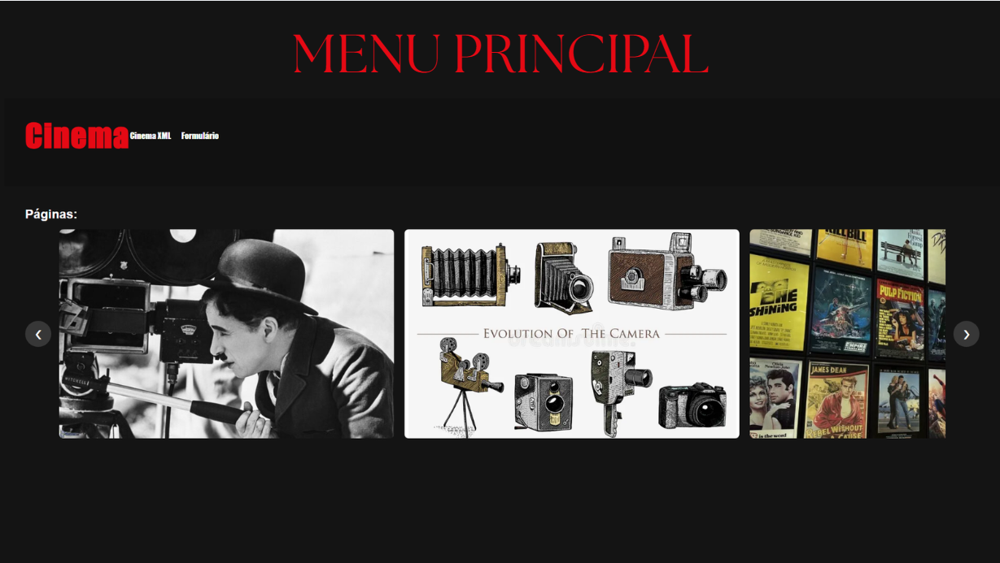

Feito por:
Tiago Loureiro 050198
Leonardo Veiga 050191
Eduardo Martins 050325
Informática A